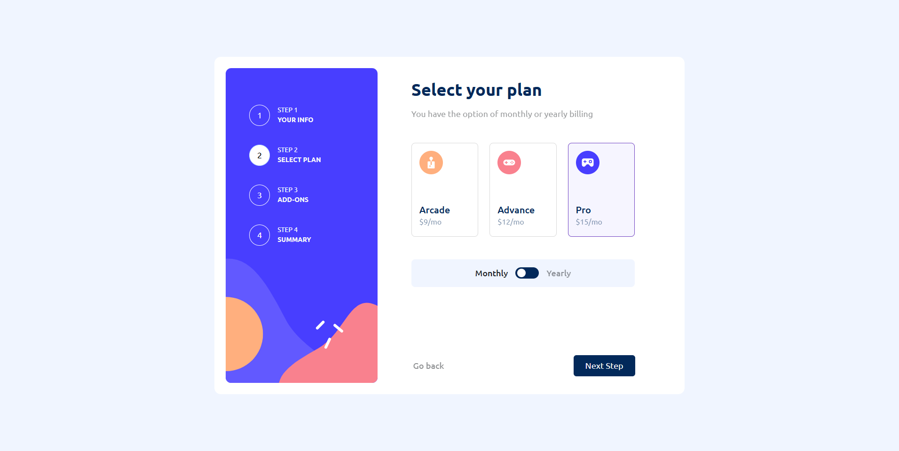

# Frontend Mentor - Multi-step form solution

This is a solution to the [Multi-step form challenge on Frontend Mentor](https://www.frontendmentor.io/challenges/multistep-form-YVAnSdqQBJ). Frontend Mentor challenges help you improve your coding skills by building realistic projects. 

## Table of contents

- [Overview](#overview)
  - [The challenge](#the-challenge)
  - [Screenshot](#screenshot)
  - [Links](#links)
  - [Built with](#built-with)
  - [What I learned](#what-i-learned)
  - [Useful resources](#useful-resources)
- [Author](#author)

**Note: Delete this note and update the table of contents based on what sections you keep.**

## Overview

### The challenge

Users should be able to:

- Complete each step of the sequence
- Go back to a previous step to update their selections
- See a summary of their selections on the final step and confirm their order
- View the optimal layout for the interface depending on their device's screen size
- See hover and focus states for all interactive elements on the page
- Receive form validation messages if:
  - A field has been missed
  - The email address is not formatted correctly
  - A step is submitted, but no selection has been made

### Screenshot

### Links

- Solution URL: [https://github.com/Ohzzy90/multistepform]
- Live Site URL: [https://multistepformcheckout.netlify.app/]

## My process

### Built with

- Semantic HTML5 markup
- CSS custom properties
- Flexbox
- CSS Grid
- JavaScript - JS
- [Node.js](https://nodejs.org/) - Vite
- [Bootstrap](https://bootstrap.com/) - For styles

### What I learned
Better knowledge of handing arrays and objects

## Author

- Website - comi
- Frontend Mentor - [@Ohzzy90](https://www.frontendmentor.io/profile/ohzzy90)
- Twitter - [@ohzzy_90](https://www.twitter.com/ohzzy_90)
